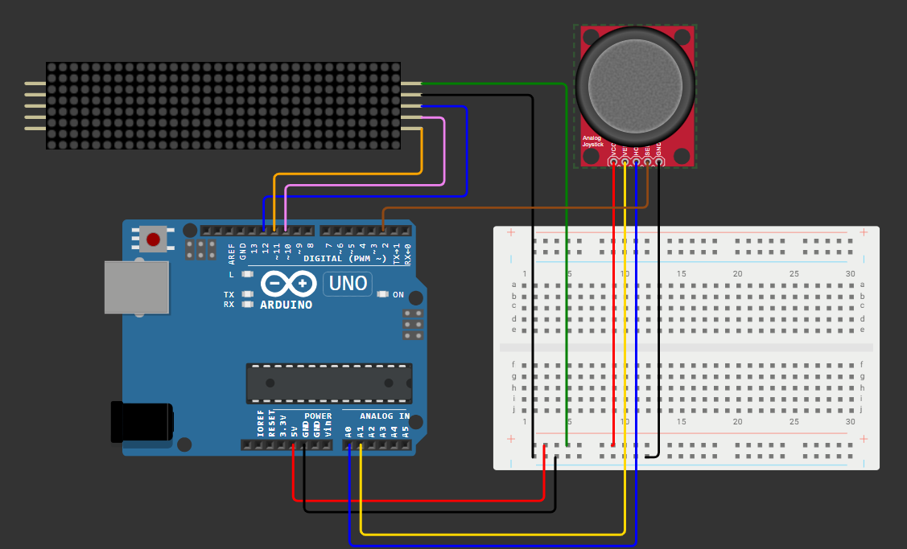
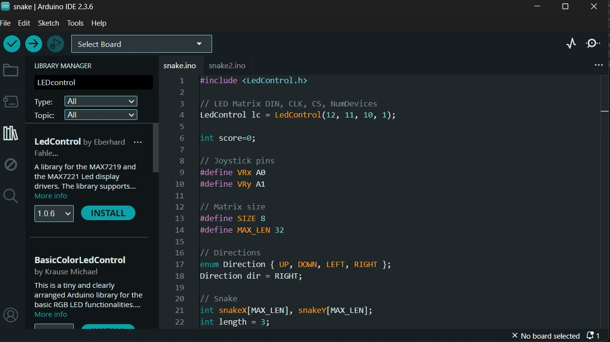

#  Snake Game on Arduino (8x8 LED Matrix)

> A classic Snake Game implemented on Arduino with an 8x8 LED Matrix and Joystick — demonstrating real-time control, LED animation, and embedded game logic.

---

##  Introduction  
The **Snake Game on Arduino** is a fun and interactive project that brings a nostalgic game to life using **embedded hardware**.  
It utilizes an **8x8 LED Matrix (MAX7219)** for display and a **joystick module** for directional control.  
Perfect for learning **Arduino programming**, **LED matrix handling**, and **game logic** in real-time systems.

---

  

---

##  User Instructions  

###  Hardware Requirements  
- **Arduino**  
- **8x8 LED Matrix (MAX7219 or compatible)**  
- **Joystick Module** (or 4-direction buttons)  
- **Breadboard and jumper wires**

  

---

### ⚙️ Software Setup  

#### Installations  
- [Arduino IDE](https://www.arduino.cc/en/software)  
- **LedControl Library**  
  - Open **Arduino IDE → Sketch → Include Library → Manage Libraries**  
  - Search for `LedControl` and install it  
  - Or refer to your saved image:  
    

---

###  Circuit Connections  

#### LED Matrix  
| Matrix Pin | Arduino Pin |
|-------------|-------------|
| VCC         | 5V          |
| GND         | GND         |
| DIN         | 12          |
| CLK         | 11          |
| CS          | 10          |

#### Joystick  
| Joystick Pin | Arduino Pin |
|---------------|-------------|
| VRx           | A0          |
| VRy           | A1          |
| SW            | 2           |

---

##  Game Logic  
- The LED matrix displays the **snake** and **food** positions.  
- The joystick controls movement (**Up**, **Down**, **Left**, **Right**).  
- Eating food increases the snake’s length and places new food randomly.  
- The game ends if the snake **collides with itself** or **the boundary**.

---

##  Getting Started  

1. Open `snake.ino` in **Arduino IDE**.  
2. Select **Tools → Board → Arduino**.  
3. Connect your Arduino via USB.  
4. Upload the sketch to the board.  
5. Once the LED matrix initializes, use the joystick to control your snake!

---

##  Developer Instructions  
- The project uses the **LedControl** library to drive the 8x8 LED Matrix.  
- Joystick readings are taken via analog pins **A0** and **A1**, and **digital pin 2** for the switch.  
- Modify variables in the code to change:
  - Snake speed or delay time  
  - Matrix update rate  
  - Game difficulty levels  

---

##  Contribution Guidelines  
Want to make it better? You can help by:  
- Improving **animations** or **game feedback** (like blink/game over patterns)  
- Writing documentation for beginners  
- Creating a modular structure for **reusability**

Open a pull request or issue to suggest improvements!

---

✨ **Enjoy building and playing your own Snake Game on Arduino!**
